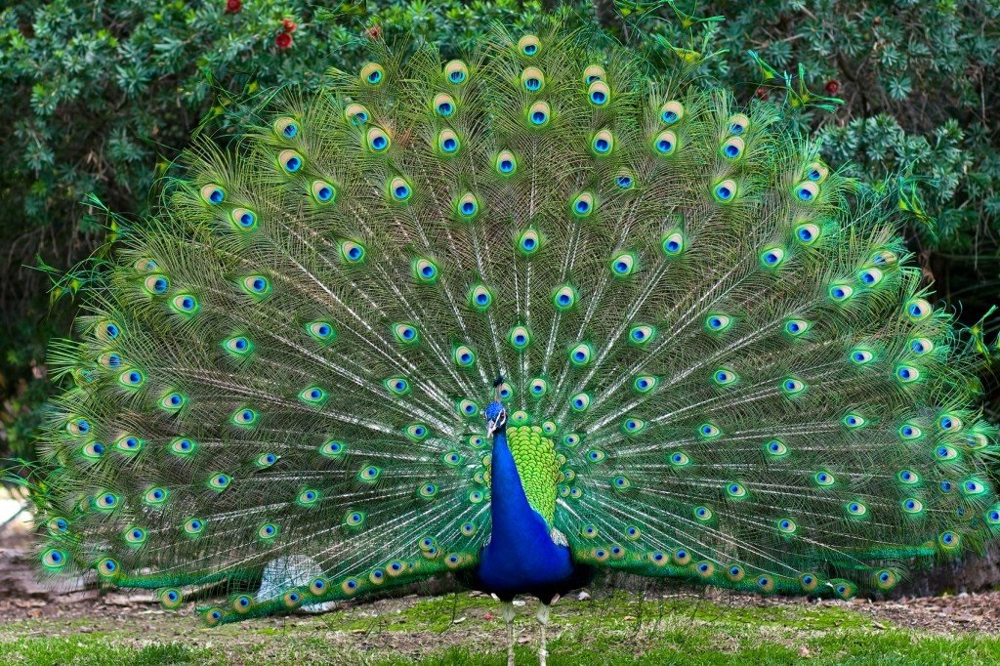
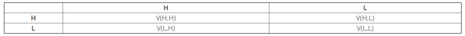
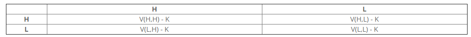

```{r setup, include=FALSE}
options(htmltools.dir.version = FALSE)
library(knitr)
opts_chunk$set(
  fig.align="center",  
  fig.height=4, #fig.width=6,
  # out.width="748px", #out.length="520.75px",
  dpi=300, #fig.path='Figs/',
  cache=T#, echo=F, warning=F, message=F
  )
library(tidyverse)
library(hrbrthemes)
```

# Sexual Selection

<div align="center">

</div>

---

# Costly Behavior

<div align="center">

</div>

---

# Costly Signals in Economics - Spence 1973

<div align="center">

</div>

---

# Summary

- Costly signaling is honest

- The costs of signaling doesn't have to be different between types

- Signaling allows receivers to discriminate

- Signaling benefits high type individuals in within group competition

---
# Motivation

- Costly signling can be seen in some but not all animals, what determines where we see his signaling?

- Signaling benefits high type individuals in *within* group competition, but what about *between* group competition?

- We propose that the benefit of signaling to the group is that signaling increases the *speed* of evolution 

- We explore this idea by modeling otherwise identical isolated populations, one with signaling and the other without

---

# Model - Non-Signaling

<div align="center">

</div>

Presented are the payoffs for the row player. 

Individuals randomly match with other individuals in thier population each period.

We are interested in a scenario where absent of signaling high types still evolve (survival of the fittest).

So we enforce the relation:

$$V(H,H)>V(H,L), V(L,H)>V(L,L)$$
---

# Model - Non-Signaling Dynamics

<div align="center">

</div>

$N_t$: Non-signaling population at time $t$

$N^H_t$: Amount of high types in the non-signaling population

$N^L_t$: Amount of low types in the non-signaling population

So, $N_t=N^H_t+N^L_t$. 

$N^H_t$ and $N^L_t$ evolve according to their expected payoffs from the above payoff table. So we have:

$$N^H_{t+1}=[\frac{N^H_t}{N_t}*V(H,H)+\frac{N^L_t}{N_t}*V(H,L)]*N^H_t$$
$$N^L_{t+1}=[\frac{N^H_t}{N_t}*V(L,H)+\frac{N^L_t}{N_t}*V(L,L)]*N^L_t$$
---

# Dynamics - Non-Signaling Population Reproductive Rate

<div align="center">

</div>
Paramaters:
$V(H,H) = 1.15$,
$V(H,L) = 0.90$,
$V(H,H) = 0.85$,
$V(H,L) = 0.80$,
$N_0^H = .2$,
$N_0^L = .8$
---

# Dynamics - Non-Signaling Population

<div align="center">

</div>
Paramaters:
$V(H,H) = 1.15$,
$V(H,L) = 0.90$,
$V(H,H) = 0.85$,
$V(H,L) = 0.80$,
$N_0^H = .2$,
$N_0^L = .8$
---

# Dynamics - Non-Signaling Population Growth

<div align="center">

</div>
Paramaters:
$V(H,H) = 1.15$,
$V(H,L) = 0.90$,
$V(H,H) = 0.85$,
$V(H,L) = 0.80$,
$N_0^H = .2$,
$N_0^L = .8$
---

# Model - Signaling

<div align="center">

</div>

Presented are the payoffs for the row player.

$K$: the cost of signaling.

The benefit of signaling is that signalers are able to discriminate and only match with each other.

Incentive compatibility:

$$V(L,L)>V(L,H)-K$$
$$V(H,H)-K>V(H,L)$$

So, in order for a viable signal cost to exist, it must be the case that:
$$V(H,H)+V(L,L)>V(L,H)+V(H,L)$$
Recall: This is the single crossing property
---

# Model - Signaling Dynamics

<div align="center">

</div>

$S_t$: Non-signaling population at time $t$

$S^H_t$: Amount of high types in the signaling population

$S^L_t$: Amount of low types in the signaling population

So, $S_t=S^H_t+S^L_t$. 

$S^H_t$ and $S^L_t$ evolve according to their expected payoffs from the above payoff table. Because of signaling high and low types only match with eachother so we have:

$$S^H_{t+1}=[V(H,H)-K]*S^H_t$$
$$S^L_{t+1}=V(L,L)*S^L_t$$
---

# Dynamics - Signaling Population Reproductive Rate

<div align="center">

</div>
Paramaters:
$V(H,H) = 1.15$,
$V(H,L) = 0.90$,
$V(H,H) = 0.85$,
$V(H,L) = 0.80$,
$N_0^H = .2$,
$N_0^L = .8$,
$K = .1$
---

# Dynamics - Signaling Population

<div align="center">

</div>
Paramaters:
$V(H,H) = 1.15$,
$V(H,L) = 0.90$,
$V(H,H) = 0.85$,
$V(H,L) = 0.80$,
$N_0^H = .2$,
$N_0^L = .8$,
$K = .1$
---

# Dynamics - Signaling Population Growth

<div align="center">

</div>
Paramaters:
$V(H,H) = 1.15$,
$V(H,L) = 0.90$,
$V(H,H) = 0.85$,
$V(H,L) = 0.80$,
$N_0^H = .2$,
$N_0^L = .8$,
$K = .1$
---

# Dynamics - Comparing Reproductive Rates

<div align="center">

</div>
Paramaters:
$V(H,H) = 1.15$,
$V(H,L) = 0.90$,
$V(H,H) = 0.85$,
$V(H,L) = 0.80$,
$N_0^H = .2$,
$N_0^L = .8$,
$K = .1$
---

# Dynamics - Comparing Populations

<div align="center">

</div>
Paramaters:
$V(H,H) = 1.15$,
$V(H,L) = 0.90$,
$V(H,H) = 0.85$,
$V(H,L) = 0.80$,
$N_0^H = .2$,
$N_0^L = .8$,
$K = .1$
---

# Dynamics - Comparing Growth

<div align="center">

</div>
Paramaters:
$V(H,H) = 1.15$,
$V(H,L) = 0.90$,
$V(H,H) = 0.85$,
$V(H,L) = 0.80$,
$N_0^H = .2$,
$N_0^L = .8$,
$K = .1$
---
# What might happen if these populations meet?

In the next section we introduce a model where signaling and nonsignaling populations compete

Allopatric speciation with secondary contact

The result of this competition is likely to depend on a number of factors: how long they were seperated, how firece the competition is, and how costly the signal is.

---

# Model - Competition Dynamics

Starting at period $T$, the non-signaling population and the signaling population engage in competition and start to eliminate the other population according to Lanchester's square law. 

In each period, before reproduction, each member of a population kills $\beta$ members of the other population, independent of their type. So the dynamics for $N^H, N^L, S^H,$ and $S^L$ are now:


$$N^H_{t+1}=[\frac{N^H_t}{N_t}*V(H,H)+\frac{N^L_t}{N_t}*V(H,L)]*max\{[N^H_t-\beta \frac{N^H_t}{N_t} I_{t \geq T}S_t],0\}$$
$$N^L_{t+1}=[\frac{N^H_t}{N_t}*V(L,H)+\frac{N^L_t}{N_t}*V(L,L)]*max\{[N^L_t-\beta \frac{N^L_t}{N_t} I_{t \geq T}S_t],0\}$$
$$S^H_{t+1}=[V(H,H)-K]*max\{[S^H_t-\beta \frac{S^H_t}{S_t} I_{t \geq T}N_t],0\}$$
$$S^L_{t+1}=V(L,L)*max\{[S^L_t-\beta \frac{S^L_t}{S_t} I_{t \geq T}N_t],0\}$$

In the equations above, $I_{t \geq T}$ is an indicator that the groups are engaging in group competition and the max argument simply ensures that the populations don't reach a negative number.

---

# Dynamics - Competition Where Non-Singaling Wins

<div align="center">

</div>
Paramaters:
$V(H,H) = 1.15$,
$V(H,L) = 0.90$,
$V(H,H) = 0.85$,
$V(H,L) = 0.80$,
$N_0^H = .2$,
$N_0^L = .8$,
$K = .1$,
$\beta = .2$, The vertical line indicate the last period before competition begins $(T-1)$.
---

# Dynamics - Competition Where Singaling Wins

<div align="center">

</div>
Paramaters:
$V(H,H) = 1.15$,
$V(H,L) = 0.90$,
$V(H,H) = 0.85$,
$V(H,L) = 0.80$,
$N_0^H = .2$,
$N_0^L = .8$,
$K = .1$,
$\beta = .2$, The vertical line indicate the last period before competition begins $(T-1)$.
---

# Dynamics - Special Case

<div align="center">

</div>
Paramaters:
$V(H,H) = 1.15$,
$V(H,L) = 0.90$,
$V(H,H) = 0.85$,
$V(H,L) = 0.80$,
$N_0^H = .2$,
$N_0^L = .8$,
$K = .1$,
$\beta = .2$, 
The vertical line indicate the last period before competition begins $(T-1)$.
---

# Comparative Statics - BT

<div align="center">

</div>
Paramaters:
$V(H,H) = 1.15$,
$V(H,L) = 0.90$,
$V(H,H) = 0.85$,
$V(H,L) = 0.80$,
$N_0^H = .2$,
$N_0^L = .8$,
$K = .1$,
$\beta = .2$,
$T = 20$

The white lines indicate the current values
---

# Comparative Statics - KT

<div align="center">

</div>
Paramaters:
$V(H,H) = 1.15$,
$V(H,L) = 0.90$,
$V(H,H) = 0.85$,
$V(H,L) = 0.80$,
$N_0^H = .2$,
$N_0^L = .8$,
$K = .1$,
$\beta = .2$,
$T = 20$

The white lines indicate the current values
---

# Comparative Statics - KB

<div align="center">

</div>
Paramaters:
$V(H,H) = 1.15$,
$V(H,L) = 0.90$,
$V(H,H) = 0.85$,
$V(H,L) = 0.80$,
$N_0^H = .2$,
$N_0^L = .8$,
$K = .1$,
$\beta = .2$,
$T = 20$

The white lines indicate the current values
---

# Conclusion

This model might explain why some classes of life and biomes are more likely to exhibit costly signaling. For example, birds and fish with their mobility likely have shorter periods of seperation compared to other animals. Areas like rainforests that have firece competition for resources in every niche are likely to have a higher proportion of costly signalers than other habitats.